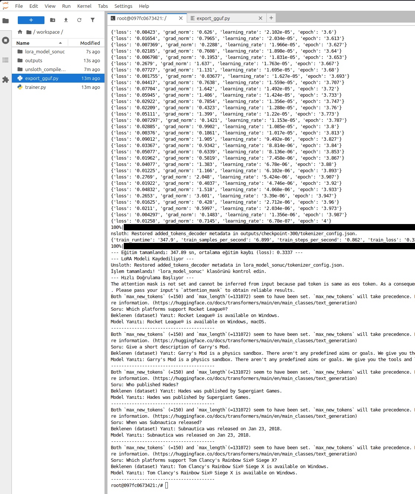
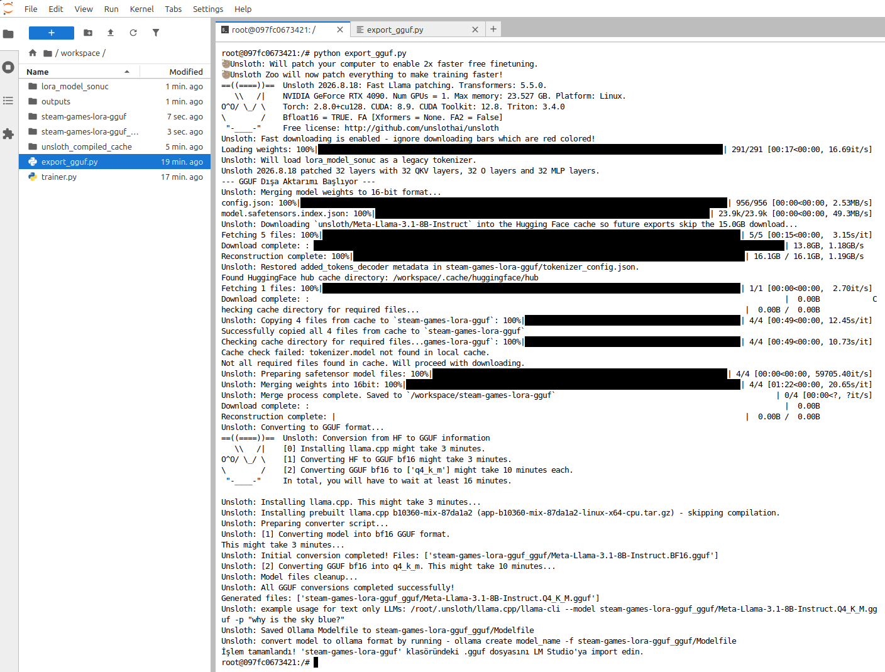
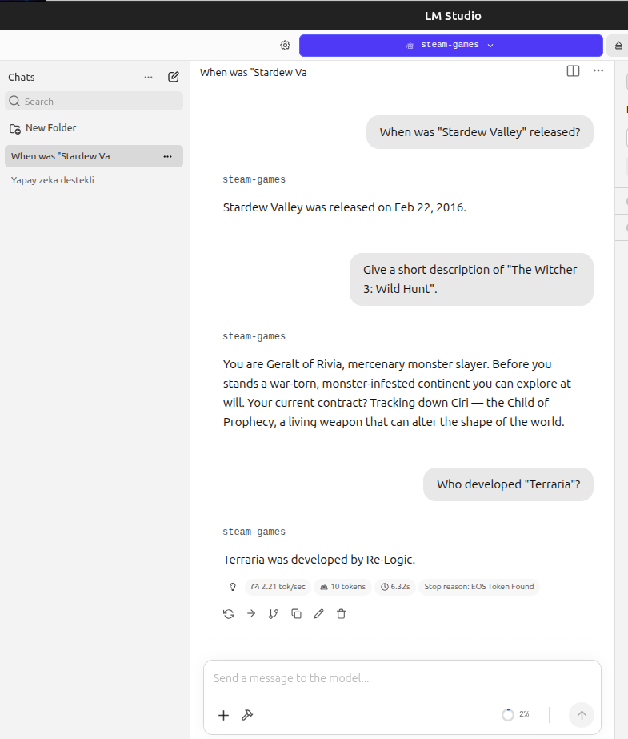

# LoRA2 - Steam Oyunları Bilgi Tabanı Örneği

Bu klasör, [../LoRA](../LoRA) klasöründeki örneğe ikinci bir alternatif sunar. Amaç orada olduğu gibi yine belirli **gerçekleri** *(bu kez ders içeriği yerine Steam oyun verileri)* modele öğretmektir. Veri seti bu kez elle yazılan bir JSON dosyası değil, Hugging Face üzerinde yer alan [`Z02Z/steam-games-dataset`](https://huggingface.co/datasets/Z02Z/steam-games-dataset) veri setinden programatik olarak üretilmektedir.

Steam veri seti yaklaşık olarak 123.000 Steam oyununa ait tür, geliştirici, yayıncı, fiyat, platform, açıklama gibi **yapılandırılmış (tabular)** alanlar içerir. Bu, ana [README](../../../README.md)'de "Uygulama Önerileri" bölümünde geçen **Gamepedia** proje fikriyle (online oyun ansiklopedisi) doğrudan örtüşüyor. Veri setinde hazır `instruction`/`output` kolonları **yok**; bu yüzden `trainer.py` içinde bu alanlardan soru-cevap çiftleri üretiliyor. Örneğin, bir oyun için `genres` alanı "Action, Adventure" ise üretilen soru-cevap çifti şöyle olabilir:

```text
Soru: What are the genres of the game "Hollow Knight"?
Cevap: The genres of the game "Hollow Knight" are Action and Adventure.
```

## trainer.py Nasıl Çalışır?

1. `Z02Z/steam-games-dataset` Hugging Face'ten indirilir.
2. `name`, `genres`, `short_description` alanlarından herhangi biri eksik olan satırlar elenir.
3. Kalan satırlar `positive` (olumlu yorum sayısı) kolonuna göre sıralanır ve en tanınmış `GAME_COUNT` (varsayılan: 150) oyun seçilir. Böylece LM Studio'da elle test ederken sonuçları değerlendirmek kolaylaşır *(örn. iyi bilinen bir oyun hakkında soru sorabilirsiniz)*
4. Her oyun için mevcut alanlara göre *(tür, geliştirici, yayıncı, çıkış tarihi, fiyat, platformlar, kısa açıklama, Metacritic puanı)* en fazla `MAX_QA_PER_GAME` (varsayılan: 4) adet İngilizce soru-cevap çifti üretilir. Eksik/boş alanlar için soru üretilmez.
5. Üretilen çiftler, `LoRA` klasöründeki örnekte olduğu gibi modelin kendi sohbet şablonuna *(`tokenizer.apply_chat_template`)* göre biçimlendirilir ve sadece asistan yanıtı üzerinden *(`train_on_responses_only`)* eğitilir.
6. Eğitim sonunda, **üretilen veri setinden rastgele seçilen** 5 soru için modelin greedy *(`do_sample=False`)* yanıtı, eğitimde kullanılan gerçek *(beklenen)* yanıtla yan yana yazdırılır. Bu, GGUF'a aktarmadan/LM Studio'ya yüklemeden önce eğitimin işe yarayıp yaramadığını anlamanın en hızlı yoludur.

`GAME_COUNT` ve `MAX_QA_PER_GAME` değerlerini artırmak daha zengin bir bilgi tabanı sağlar ama toplam örnek sayısını (dolayısıyla RunPod'daki GPU süresini) artırır.

## İlk LoRA Örneğinden Farkları

- Veri seti yerelde bir JSON dosyası olarak değil, `datasets.load_dataset("Z02Z/steam-games-dataset")` ile doğrudan Hugging Face'ten indiriliyor ve soru-cevap çiftleri kod içinde üretiliyor.
- Model seçimi `trainer.py` başındaki `MODEL_CONFIGS` sözlüğü ve `BASE_MODEL_CHOICE` değişkeni ile yapılandırılabilir; `"llama-3.1"` veya `"qwen-2.5"` arasında tek satır değiştirerek geçiş yapılabilir.
- Amaç yine ezberletme *(fact memorization)* olduğu için LoRA rank/alpha (32/32) ve adım sayısı *(300)*, `LoRA` klasöründeki örneğe benzer şekilde yüksek tutulmuştur.
- Hızlı doğrulama adımı sabit sorular yerine, üretilen veri setinden rastgele örnekler kullanır ve modelin yanıtını beklenen yanıtla doğrudan karşılaştırır.

## Modelin Eğitilmesi ve GGUF'a Aktarılması

> Runpod.ai tarafındaki kurulumlar versiyonlara göre farklılık gösterebilir. Bir önceki örnekte yer alan kurulum talimatları bu örnek için de geçerlidir.

Eğitimi başlatın:

```bash
python trainer.py
```

Çalışma tamamlandığında terminalde sırasıyla şunları görmelisiniz:

- Üretilen toplam soru-cevap çifti sayısı *(örneğin "150 oyundan toplam ~550 soru-cevap çifti üretildi")*.
- Eğitim süresi ve ortalama kayıp (loss) değeri.
- `lora_model_sonuc` klasörünün oluşturulduğuna dair mesaj.
- Rastgele seçilen 5 soru için hem beklenen *(dataset)* yanıtı hem de modelin ürettiği yanıtı içeren bir "Hızlı Doğrulama" bölümü. Model yanıtları beklenen yanıtlara yakınsa eğitim başarılı sayılabilir; bu aşamada henüz GGUF'a aktarmaya veya LM Studio'ya gerek yoktur. Yanıtlar tutarsız/hayali ise `max_steps` değerini artırıp tekrar deneyin.

Eğitim sonucu tatmin ediciyse GGUF formatına aktarın:

```bash
python export_gguf.py
```

Son olarak `steam-games-lora-gguf` klasöründeki `.gguf` dosyasını LM Studio'ya yükleyin.

## LM Studio'da Test Ederken Dikkat Edilmesi Gerekenler

- Bu model, kendi sohbet şablonuyla *(Llama 3.1 veya Qwen 2.5'in resmi chat template'i)* eğitiliyor. Dolayısıyla LM Studio'nun varsayılan **chat modu** doğrudan kullanılabilir, ham/tamamlama *(completion)* modu gerekmez.
- Test ederken eğitimde kullanılan `GAME_COUNT` kadar oyunun *(varsayılan: en popüler 150 Steam oyunu)* modele öğretildiğini unutmayalım. Eğitim verisinde yer almayan bir oyun hakkında soru sorarsak model muhtemelen hayali bir cevap üretecektir ki bu beklenen bir davranıştır.
- Tutarlı, kelimesi kelimesine doğru cevaplar almak istiyorsak LM Studio'daki `temperature` değerini düşük *(örn. 0-0.2 derece aralığında)* tutmak işe yarayabilir. Yüksek sıcaklıkta aynı soruyu tekrar sorduğumuzda farklı *(ve bazen yanlış)* yanıtlar alabiliyoruz. Bu durum eğitimdeki bir hatadan değil, örnekleme *(sampling)* rastgeleliğinden kaynaklanır.

## Base Model Değiştirme

`trainer.py` dosyasının en üstündeki `BASE_MODEL_CHOICE` değişkenini `"llama-3.1"` yerine `"qwen-2.5"` yaparak Qwen2.5-7B-Instruct ile de eğitim yaptırabiliriz. `MODEL_CONFIGS` sözlüğü, her model için doğru model adını, sohbet şablonunu ve `train_on_responses_only` için gereken talimat/yanıt sınır değerlerini otomatik olarak eşleştirir.

## Sorabileceğimiz Örnek Sorular

Eğitim veri seti `positive` (olumlu yorum) sayısına göre en popüler `GAME_COUNT` oyundan üretildiği için, Steam'in tüm zamanların en çok yorum alan oyunlarından bazılarının (aşağıdaki gibi) eğitim setinde yer alma ihtimali yüksektir. Yine de kesin liste, script'i çalıştırdığınız anda veri setinden gelen güncel `positive` sıralamasına bağlıdır; LM Studio'daki soruları sormadan önce `trainer.py` çıktısındaki "Hızlı Doğrulama" bölümünde hangi oyunların/soruların gerçekten eğitime dahil olduğunu görebilirsiniz.

```text
What are the genres of the game "Counter-Strike 2"?
Who developed "Terraria"?
Who published "Portal 2"?
When was "Stardew Valley" released?
How much does "Team Fortress 2" cost?
Which platforms support "Dota 2"?
Give a short description of "The Witcher 3: Wild Hunt".
What is the Metacritic score of "Half-Life 2"?
```

İşte çalışma zamanından birkaç görüntü.

Eğitim tamamlandıktan sonra,



Runpod Jupyter Notebook'ta gguf üretimi,



ve LM Studio'da test ederken modelin verdiği yanıtlar.


