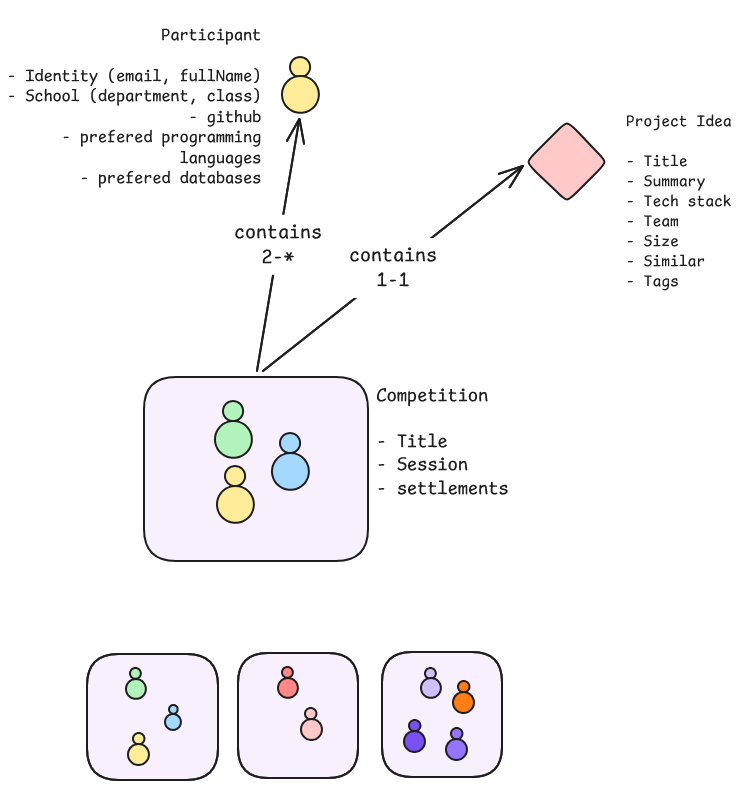

# Project Router

|            |                                                                                                              |
| ---------- | ------------------------------------------------------------------------------------------------------------ |
| İsim       | Project Router                                                                                               |
| Amaç       | Derse katılan öğrencileri dönem projelerine belirli kriterlere göre otomatik dağıtan bir sistem geliştirmek. |
| Tech Stack | .Net 10, C#, Sqlite, Razor Based Web App                                                                     |



## Modeller

### Katılımcı (Participant)

Projeyi alan katılımcı. Özellikleri;

- Kimlik
  - isim
  - email
- Okul
- Branş
- Sınıf
- Github hesabı
- Çalışmayı tercih ettiği programlama dilleri
- Çalışmak istediği veritabanı/tabanları

Örnek veri;

```json
{
  "identity": {
    "id": "participant-001",
    "fullName": "Can Kulod Van Dam",
    "email": "canklaud@marvel.corp.com"
  },
  "university": "BatCave Technic",
  "department": "Software Engineering",
  "class": 4,
  "github": "https://github.com/canklaudvandam",
  "languages": [
    "C#",
    "Pyhton"
  ],
  "databases":[
    "Sql Server",
    "NoSQL-*"
  ]
}
```

### Proje (Idea)

Projeye ait bilgiler. Özellikleri;

- projenin kısa adı
- kısa tarifi (max 250 karakter)
- teknoloji alt yapısı
- kişi sayısı(min, max)
- büyüklük (t-shirt size, Small, Medium, Large, X-Large)
- benzerleri
- tags

Örnek veri;

```json
{
  "id": "project-001",
  "title": "Kahoot Clone",
  "summary": "Çevrimiçi bilgi yarışması platformudur. Maksimum 50 yarışmacı aynı anda yarışır...",
  "techStack": {
    "languages": [
      "python"
    ],
    "platform": [
      "web",
      "mobile"
    ],
    "data": [
      "postgres",
      "mongodb"
    ]
  },
  "team": {
    "min": 2,
    "max": 5
  },
  "size": "L",
  "simular": [
    "Kahoot",
    "Mentimeter"
  ],
  "tags": [
    "web",
    "python",
    "programming",
    "competition-platform",
    "game"
  ]
}
```

## Turnuva (Competition)

Proje ve katılımcı bilgilerinin eşleştirildiği ana başlık. Özellikleri;

- Turnuva başlığı
- Dönem
- Yerleşim

```json
{
  "id": "competition-001",
  "title": "Yapay Zeka destekli yazılım geliştirme",
  "session": "2026-27",
  "settlement": [
    {
      "project-001": [
        "participant-001",
        "participant-002",
        "participant-003"
      ],
      "project-002": [
        "participant-099",
        "participamt-101"
      ],
      "project-005": [
        "participant-009",
        "participamt-222"
      ]
    }
  ]
}
```

## Kurallar *(Rules)*

- `Rule 00`: Bir katılımcı en az bir programlama dili tercih etmelidir. Birden fazla dil tercihi varsa `ilk tercih-son tercih` şeklinde sıralı girilmelidir.
- `Rule 01`: `Rule 00` daki kural veritabanı tercihi için de geçerlidir.
- `Rule 02`: Bir projedeki takım sayısı min ve max değer aralığı arasında olabilir. *(min:2 max:4 için bunun anlamı şudur; takımda en az 2 en fazla 4 katlımcı olabilir)*
- `Rule 03`: Bir katılımcı sadece bir projeye dahil olabilir.
- `Rule 04`: Bir proje en az bir programlama dili ve en az bir veri tabanı kullanmalıdır.

## Kullanıcı Hikayeleri *(User Stories)*

- USR 01:
- USR 02:

## Veri *(DataSets)*

- Katılımcı *(Participant)*:
- Proje Bilgileri *(Project Idea)*:
- Yerleştirme *(Competition)*:
